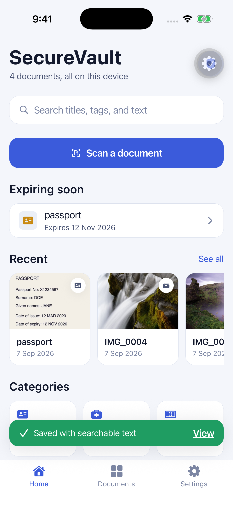
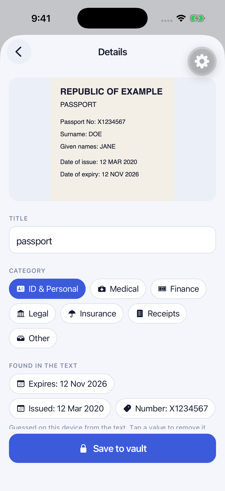
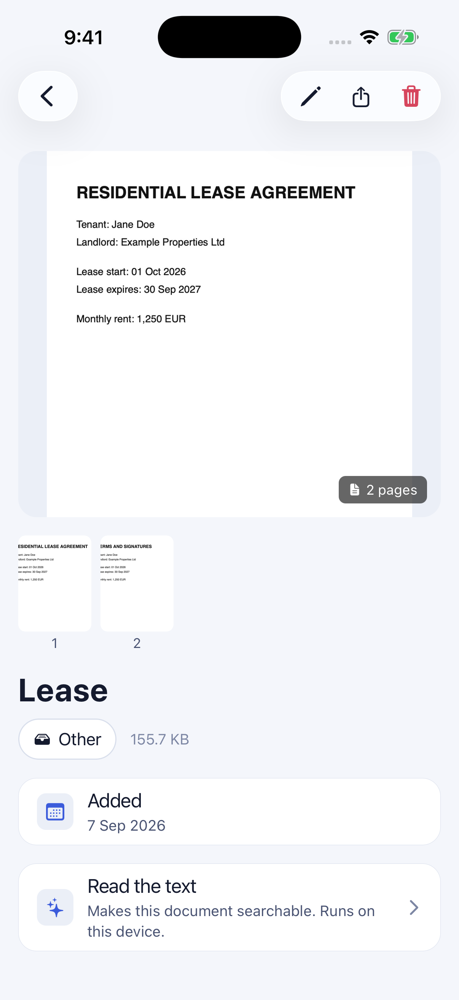
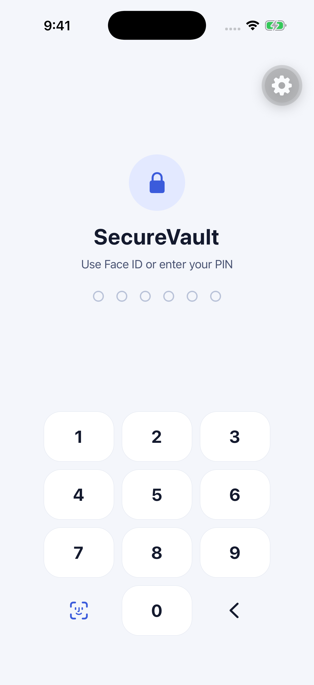
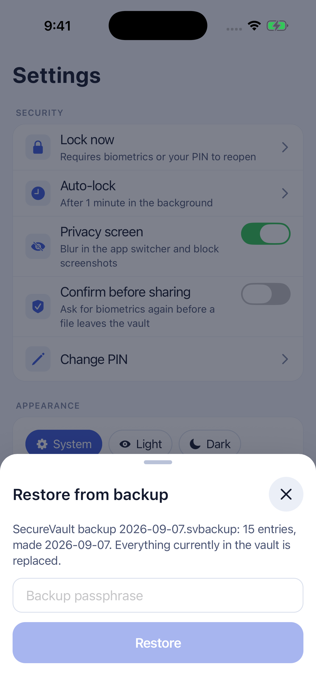
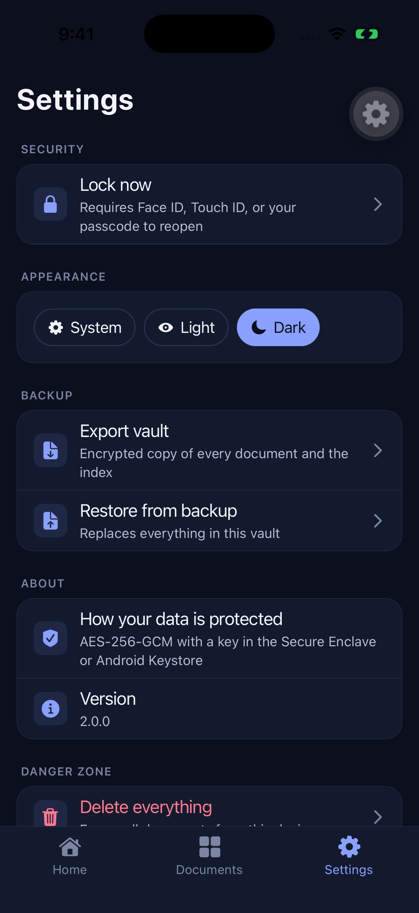
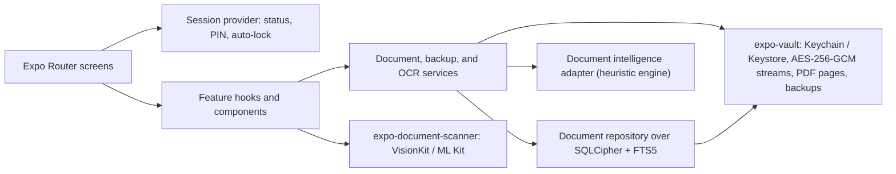

# SecureVault

**A document vault for passports, IDs, leases, and receipts, rebuilt from a 2025 prototype into a production-shaped React Native app with hardware-backed encryption, an encrypted search index, on-device scanning and text reading, and passphrase-protected backups.**

> SecureVault is a technical portfolio project. The screenshots use a
> fictional "Republic of Example" passport and lease; it is not a published
> product.

[](https://github.com/naderalfakesh/secure-vault/actions/workflows/ci.yml)

| Home with an expiry warning                                                                                            | A passport read on device                                                                                            | Two-page PDF, rendered natively                                                                                      |
| ---------------------------------------------------------------------------------------------------------------------- | -------------------------------------------------------------------------------------------------------------------- | -------------------------------------------------------------------------------------------------------------------- |
|  |  |  |

| Lock screen                                                                                        | Restore from a backup                                                                                                     | Dark mode                                                                                      |
| -------------------------------------------------------------------------------------------------- | ------------------------------------------------------------------------------------------------------------------------- | ---------------------------------------------------------------------------------------------- |
|  |  |  |

## The rebuild

The first SecureVault was a 2025 Expo SDK 53 prototype, preserved under the
[`legacy-v1`](https://github.com/naderalfakesh/secure-vault/tree/legacy-v1)
tag: a biometric prompt, a native AES-GCM module, and a JSON index that was
decrypted whole on every launch. It worked as a demo and fell over as a
product: no session, no PIN, no search index, one-shot photos, a backup only
its own device could read.

The rebuild kept the prototype's one good idea, a small Swift and Kotlin vault
module with hardware-backed keys, and replaced everything around it in nine
phases: Expo SDK 57 and React Native 0.86 on the New Architecture, a real
session model, an encrypted SQLite index with full-text search, the platform
document scanners, on-device text reading with suggestions, a page viewer,
and a portable backup format. Each phase ended with a green `npm run validate`,
a native run on both platforms, and a note under
[`docs/verification/`](docs/verification/). The
[modernization plan](docs/MODERNIZATION_PLAN.md) records the sequence and
[`docs/adr/`](docs/adr/) the decisions.

## Features

- Onboarding, a 6-digit PIN with escalating lockout, Face ID, Touch ID, or
  the device credential, auto-lock with a privacy blur, and an optional second
  biometric check before anything is shared
- Every file encrypted with AES-256-GCM under a key that never leaves the
  Secure Enclave or Android Keystore; thumbnails and pages encrypted
  separately so lists stay fast
- A SQLCipher index with FTS5 search over titles, tags, and extracted text;
  the prototype's JSON index migrates on first open
- VisionKit and ML Kit document scanning with multi-page capture, plus
  Photos and Files as secondary sources; PDFs rendered natively so one viewer
  handles everything
- On-device text reading with suggested titles, categories, tags, and typed
  fields; expiry dates surface on Home as "Expiring soon"
- A pinch-zoom page viewer with a thumbnail strip, sharing under the
  document's own name with guaranteed cleanup, and delete with undo
- Passphrase-protected `.svbackup` files that hold the documents and the
  index and restore across platforms; a wrong passphrase fails before
  anything is touched
- Light and dark themes, Dynamic Type up to 2x, reduced-motion handling, and
  44 pt touch targets throughout the design system

Spoken VoiceOver and TalkBack passes, the scanner on a physical iPhone, and
the Maestro flow remain for interactive release sign-off.

## Architecture



Screens read one session status and only mount document routes while it is
`unlocked`. Services own the two stores a document lives in: encrypted bytes
in the vault module and searchable rows in the index. The vault module is
the only code that touches keys; the index key and the backup key both
derive from it or from a passphrase, never from anything stored in plain. The
[security model](docs/SECURITY.md) draws the full key hierarchy.

## Technology

| Area       | Choice                                                                                                       |
| ---------- | ------------------------------------------------------------------------------------------------------------ |
| Runtime    | Expo SDK 57, React Native 0.86, React 19.2, New Architecture, React Compiler                                 |
| Navigation | Expo Router with typed routes and `Stack.Protected` guards                                                   |
| Styling    | Unistyles 3 with light and dark themes and a small accessible design system                                  |
| Native     | Two local Expo Modules in Swift and Kotlin: the vault and the document scanner                               |
| Storage    | expo-sqlite with SQLCipher and FTS5; expo-secure-store for the PIN record and settings                       |
| Crypto     | AES-256-GCM in 1 MiB chunks, PBKDF2-HMAC-SHA256 for the PIN and backup keys                                  |
| Text       | ML Kit text recognition, a heuristic intelligence engine behind an adapter                                   |
| Quality    | Strict TypeScript 6, Jest with React Native Testing Library and a real SQLite, ESLint, Prettier, Expo Doctor |

## Quality

CI runs `npm run validate`: formatting, lint, strict types, 14 Jest suites
with 59 tests, and Expo Doctor. The repository tests run against a real
SQLite with FTS5; the vault module ships a Jest double so services and
screens run unchanged. Native evidence covers iOS and Android development
builds for every phase, including a backup made on the iPhone simulator and
restored on the Android emulator. The per-phase records live under
[`docs/verification/`](docs/verification/).

## Project structure

```text
app/                     Expo Router routes: lock, setup, tabs, documents, settings
src/components/ui/       Accessible design-system primitives
src/features/            Session, auth, documents, intelligence, viewer
src/services/            Document, backup, and OCR services
src/data/                Repository, schema and migrations, SQLCipher adapter
src/theme/               Colors, tokens, typography, Unistyles setup
modules/expo-vault/      Swift and Kotlin vault: keys, encrypted files, PDF pages, backups
modules/expo-document-scanner/  VisionKit and ML Kit scanner
plugins/                 Config plugins, including the ML Kit simulator fix
docs/                    Plan, security model, ADRs, verification records, screenshots
```

## Run locally

Prerequisites: Node.js 24 (`.nvmrc`), npm, Xcode with CocoaPods for iOS, and
Android Studio with an SDK and JDK 17+ for Android. Expo Go is not a
supported runtime; the app needs a development build for its native modules.

```sh
npm install
npm run validate
npx expo prebuild --clean
npm run ios
# or
npm run android
```

On the iOS simulator, enrol Face ID under Features before the first unlock;
VisionKit's scanner needs a physical iPhone, so the simulator offers the
camera instead. On the Android emulator, set a screen lock first
(`adb shell locksettings set-pin 1234`) because the vault key requires one.

| Command                           | Purpose                                                    |
| --------------------------------- | ---------------------------------------------------------- |
| `npm start`                       | Start Metro for the development client                     |
| `npm run ios` / `npm run android` | Generate and run a native build                            |
| `npm test`                        | Run the Jest suites                                        |
| `npm run validate`                | Run formatting, lint, strict types, tests, and Expo Doctor |

## Historical context

The prototype's plan and its state before the rebuild are kept in
[`docs/legacy-project-plan.md`](docs/legacy-project-plan.md) and the
[legacy baseline](docs/verification/legacy-baseline-verification.md). The
current interface, screenshots, and native code are new work.

## Contributing and license

Contributions follow [CONTRIBUTING.md](CONTRIBUTING.md): fictional documents
only, single-line conventional commits, and `npm run validate` before review.
The code is available under the [MIT License](LICENSE).
